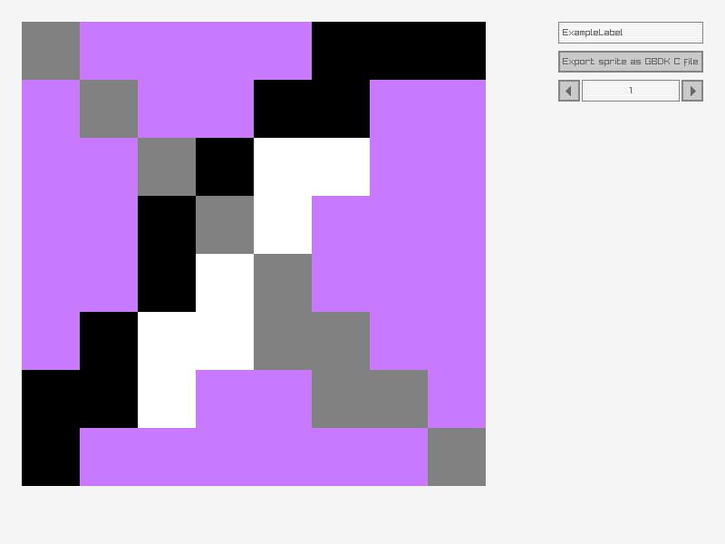

# Raylib Gameboy Artist

Raylib Gameboy Artist is a pixel art editor designed for creating and exporting sprites in a format compatible with the Game Boy Development Kit (GBDK). This tool allows you to draw pixel art and export it as monochrome sprites that can be used in Game Boy games.

## Features

- Draw pixel art on an 8x8 grid
- Use different colors for your pixel art
- Export sprites in a format compatible with GBDK
- Simple and intuitive GUI using Raylib and Raygui

## Screenshot



## Installation

1. Clone the repository:
    ```sh
    git clone https://github.com/chudware/gb-artist.git
    cd gb-artist
    ```

2. Install dependencies:
    - Ensure you have Raylib installed. You can follow the instructions on the [Raylib website](https://www.raylib.com/).

3. Build the project:
    ```sh
    sh resetBuild.sh
    ```

## Usage

1. Run the application:
    ```sh
    ./build/template/template
    ```

2. Use the GUI to draw your pixel art on the 8x8 grid.

3. Click the "Export sprite as GBDK C file" button to export your sprite.

## Exported File Format

The exported sprite is saved in a format compatible with GBDK. Each pixel is converted to a 2-bit grayscale value, and the sprite data is saved as a C array.

## Contributing

Contributions are welcome! Please fork the repository and submit a pull request with your changes.